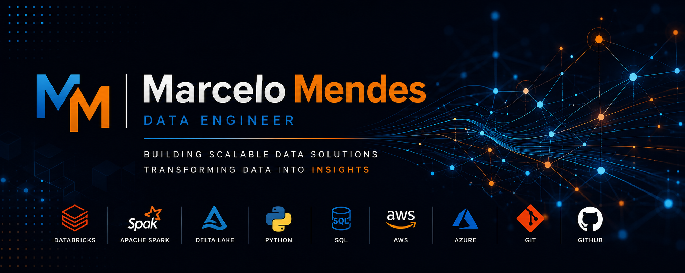

    

# 👋 Hello, I'm Marcelo Mendes

Data Engineer | Databricks | Apache Spark | Python | SQL

---

## 🚀 About Me

I'm passionate about Data Engineering and building scalable data platforms.

Currently focusing on:

- Databricks
- Apache Spark
- Delta Lake
- AWS
- Azure
- Data Engineering

---

## 🛠 Tech Stack

Databricks • Spark • Python • SQL • Git • GitHub • Delta Lake • AWS • Azure

---

## 🏆 Certifications

- Databricks Certified Data Engineer Associate

---

## ⭐ Featured Projects

### Enterprise Lakehouse with Databricks

Complete Enterprise Data Engineering project.

🔗 https://github.com/MarcelloMendes/enterprise-lakehouse-databricks

---

## 📈 GitHub Stats

---

## 📫 Connect with Me

LinkedIn
www.linkedin.com/in/marcelomendes-

GitHub
https://github.com/MarcelloMendes
